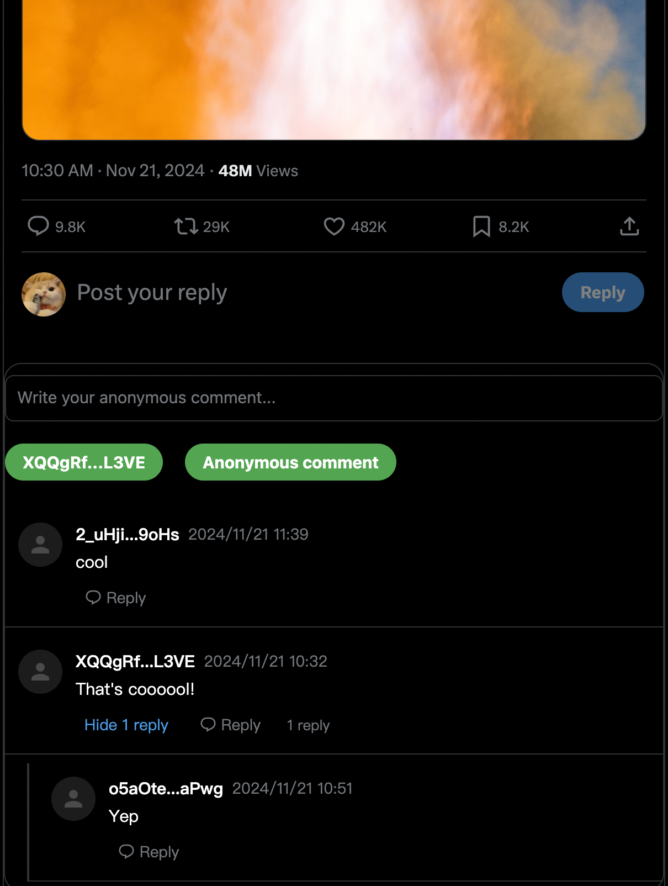

# AnonEcho

AnonEcho is a decentralized social media plugin that allows users to post anonymous messages to all websites. 
 
For now, it is available for anonymous comments on X. 
 
Currently this comment plug-in is completely decentralized and we are using AO as backend.
 
We are developing to support multiple networks (Solana evm) and multiple applications (reddit, Weibo). 
 
We hope that AnonEcho can connect various traditional social platforms and become a cross-application anonymous social network.
 

 
 
We will support more platforms soon.
 
The project need a lot of improvements. If you are interested in this project, please contact me.
 